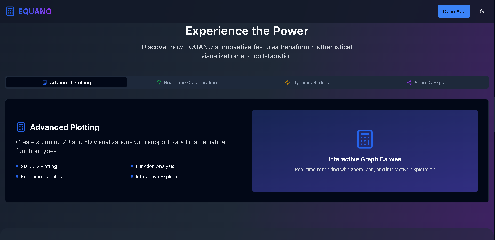

# EQUANO: Graphing Calculator

**EQUANO** is a modern, interactive graphing calculator built using React and JavaScript. Designed for students, engineers, and math enthusiasts, it supports plotting Cartesian equations with pan and zoom, multiple expression inputs, variable support, and smooth canvas rendering.

> 🚀 Built with AI using [V0 by Vercel](https://v0.dev), powered by OpenAI GPT 4o and Anthropic Claude 3.5 Sonnet.

---

## ✨ Features

- 🧮 **Multiple Equations**: Add, edit, or remove multiple expressions like `y = x^2`, `y = sin(x)`, `x = cos(y)`.
- 🎯 **Real-Time Rendering**: Graphs update live as you type.
- 🎨 **Canvas Rendering**: Smooth, pixel-perfect rendering with grid and axis.
- 🔍 **Zoom & Pan**: Navigate graphs easily with mouse or touch gestures.
- 📱 **Responsive UI**: Works on desktop, tablet, and mobile.
- ⚙️ **Expression Parsing**: Supports complex functions (e.g., `sin`, `cos`, `log`, `sqrt`).
- 💾 **Local State Persistence** *(Optional)*: Retains graphs between sessions using local storage.

---

## 🛠 Tech Stack

- **Frontend**: React + Custom CSS
- **Canvas Renderer**: HTML5 `<canvas>` API
- **Expression Evaluation**: math.js or custom parser
- **UI Components**: Built using V0 AI generation

---

## 📸 Preview

  
  

---

## 🚀 Getting Started

### Prerequisites

- Node.js >= 16
- pnpm

### Installation
git clone https://github.com/lakshgupta8/EQUANO.git
cd equano-graphing-calculator
npm install

### Run Locally
npm start
Visit http://localhost:3000 in your browser.

### Features in Development
🧮 Polar and Parametric Graphs

📝 LaTeX-style equation formatting

📊 Table of values per expression

### Powered By
This project was generated using V0 AI by Vercel, assisted by OpenAI's GPT-4. The canvas rendering, expression parsing, and graph logic were refined manually post-generation.

📄 License
This project is licensed under the MIT License.

🤝 Contributing
Pull requests are welcome! Feel free to open issues for bugs, feature requests, or design feedback.

🧑‍💻 Author
Made by Lakshya with help from V0 AI and ChatGPT.
